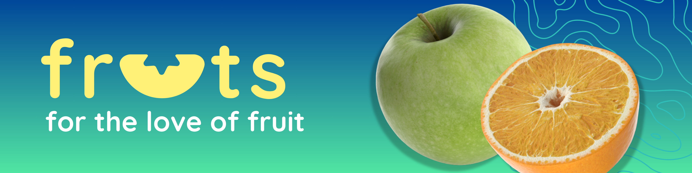
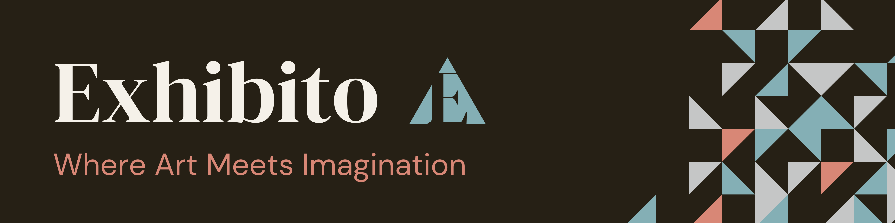
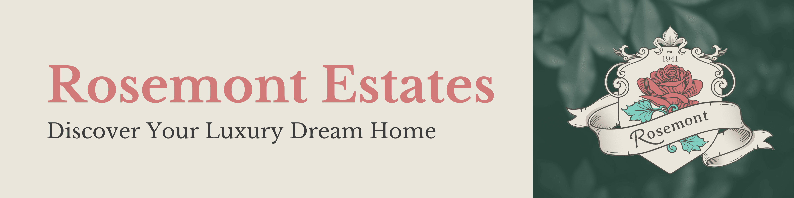
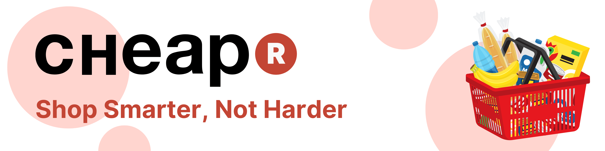

<h1 align="center">Hi, I'm Wolf 👋</h1>

  
  
  
  
  
  
  
  

Double majoring in UX Design & Interactive Development, studying part-time for 5 years (2021-2025), whilst working as a UX Designer.

  
  
My strongest skills include UX design, web development, and video editing.

  
  
I love working out, playing padel, dance and exploring the latest technologies, such as 3D printing, VR, and smart-home automation.

  
  
Fun fact: A DNA Test revealed I'm 4.2% of Middle Eastern descent.

  
  
Duolingo has kidnapped my family and won't release them unless I finish my Spanish lesson every day.

 

<h2 align="left" style="border: none">✦ 2024 Portfolio Repos ✦</h2>

  
  <h3 style="margin: 0;">Term 1: <a href="https://github.com/WolfOWI/fruts">fruts</a></h3>

A React-based web application that celebrates the love of fruit. It features interactive charts powered by Chart.js to visualise various fruit-related data, providing users with an engaging and informative experience.

**Technologies Used:** React, Express JS, Node JS, Chart.js React Chart.js 2, Axios, React Router, Tailwind CSS, Headless UI, LDRS, React Animated Cursor.

**Project Link:** [Fruts GitHub Repository](https://github.com/WolfOWI/fruts)

 

---

 

  
  <h3 style="margin: 0;">Term 2: <a href="https://github.com/WolfOWI/exhibito">Exhibito</a></h3>

A MERN stack application, Exhibito is an art exhibitions website developed as a 4-team group project. It offers full CRUD (Create, Read, Update, Delete) functionality, allowing art houses to manage exhibitions and users to explore and interact with various art events.

**Technologies Used:** MongoDB, Express JS, React, Node JS, Axios, Tailwind CSS, React Bootstrap, React Router, JWT, BCrypt, CORS.

**Project Link:** [Exhibito GitHub Repository](https://github.com/WolfOWI/exhibito)

 

---

 

  
  <h3 style="margin: 0;">Term 3: <a href="https://github.com/WolfOWI/rosemont-estates">Rosemont Estates</a></h3>

Rosemont Estates is a real estate platform designed to help users discover luxury dream homes. It features comprehensive property listings with filtering options, detailed property pages, and administrative dashboards for managing listings and client interactions.

**Technologies Used:** React, React Router, PHP, MySQL, Node JS, Leaflet Geosearch, Tailwind CSS, Chakra UI, Material UI Icons

**Project Link:** [Rosemont Estates GitHub Repository](https://github.com/WolfOWI/rosemont-estates)

 

---

 

  
  <h3 style="margin: 0;">Term 4: <a href="https://github.com/WolfOWI/cheapr">CHEAPR</a></h3>

CHEAPR is a FERN-stack web application aimed at helping users shop smarter by comparing prices of 4 x South African grocery store products. It provides a platform for users to find the best deals, save money, and plan their shopping efficiently.

**Technologies Used:** Firebase, Express JS, React, Node JS, React Router, Axios, Tailwind CSS, React Bootstrap

**Project Link:** [CHEAPR GitHub Repository](https://github.com/WolfOWI/cheapr)

 

<h2 align="left" style="border: none">✦ My Stats ✦</h2>

  

  

 

<h2 align="left" style="border: none">✦ My Skills ✦</h2>

<h4 align="center">Front End</h4>

  
  
  
  
  
  
  

<h4 align="center">Back End</h4>

  
  
  
  
  
  
  

<h4 align="center">Languages</h4>

  
  
  

<h4 align="center">Deployment</h4>

  
  
  

<h4 align="center">Software & Tools</h4>

  
  
  
  
  

 

<h2 align="left" style="border: none">✦ Get in Touch ✦</h2>

  

 
 
 
 

