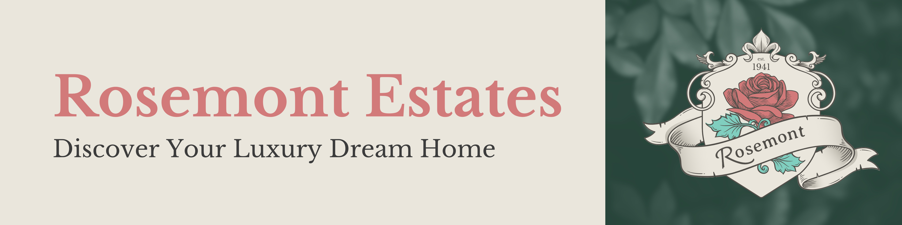

<p align="center">
  
  
  
  
  
  
  
  
</p>

```jsx
// About Me
import { pizza as favFood } from "@wolf";
import { kindness, respect, creativity } from "@core/values";

const NAME = "Wolf Botha";
const STUDENT_NUM = 21100255;

let interests = {
  fitness: ["Gym", "Dance"],
  technology: ["AI", "Tech Gadgets", "Smart Home Automation"],
  learning: ["Piano", "Spanish"],
  funFact: "4.2% Middle Eastern descent - DNA test",
};

export async function codingSession() {
  let understandCode = false;

  readDocs();
  askAI();
  understandCode = true;

  try {
    await implementCode();
    cry("happy");
  } catch (confusion) {
    console.log("Just one more console.log()");
    cry("sad");
    await readDocs();
    await askAIAgain();
    await watchYouTube("Tutorial by Indian Genius");
  } finally {
    understandCode = false; // Humility restored
  }
}

let changelog = ["Added Spanish support", "Still fixing sleep schedule 💤"];
```

<p align="center"></p>

## ✦ Skills ✦

**UX Design**  <span style="color: #666;">Strongest</span>

**Frontend Development**  <span style="color: #666;">Strong</span>

**Backend Development**  <span style="color: #666;">Competent</span>

**Testing**  <span style="color: #666;">Developing</span>

**Video Editing**  <span style="color: #666;">Strong</span>

<p style="font-size: 12px; color: #666; font-style: italic; margin: 5px 0;">*Percentages represent relative skill levels, not absolute proficiency</p>

## ✦ Tech Stack Experience ✦

### Front End

<p align="center">
  <a href="https://reactjs.org/" target="_blank" rel="noreferrer">
    
  </a>
  <a href="https://vitejs.dev/" target="_blank" rel="noreferrer">
    
  </a>
  <a href="https://ant.design/" target="_blank" rel="noreferrer">
    
  </a>
  <a href="https://mui.com/x/react-charts/" target="_blank" rel="noreferrer">
    
  </a>
  <a href="https://axios-http.com/" target="_blank" rel="noreferrer">
    
  </a>
  <a href="https://sass-lang.com/" target="_blank" rel="noreferrer">
    
  </a>
  <a href="https://getbootstrap.com" target="_blank" rel="noreferrer">
    
  </a>
  <a href="https://www.chartjs.org" target="_blank" rel="noreferrer">
    
  </a>
  <a href="https://tailwindcss.com/" target="_blank" rel="noreferrer">
    
  </a>
  <a href="https://chakra-ui.com/" target="_blank" rel="noreferrer">
    
  </a>
  <a href="https://headlessui.dev/" target="_blank" rel="noreferrer">
    
  </a>
  <a href="https://mui.com/" target="_blank" rel="noreferrer">
    
  </a>
  <a href="https://reactrouter.com/" target="_blank" rel="noreferrer">
    
  </a>
</p>

### Back End

<p align="center">
  <a href="https://dotnet.microsoft.com/" target="_blank" rel="noreferrer">
    
  </a>
  <a href="https://www.postgresql.org/" target="_blank" rel="noreferrer">
    
  </a>
  <a href="https://developers.google.com/identity/protocols/oauth2" target="_blank" rel="noreferrer">
    
  </a>
  <a href="https://nodejs.org" target="_blank" rel="noreferrer">
    
  </a>
  <a href="https://expressjs.com" target="_blank" rel="noreferrer">
    
  </a>
  <a href="https://www.mongodb.com/" target="_blank" rel="noreferrer">
    
  </a>
  <a href="https://www.mysql.com/" target="_blank" rel="noreferrer">
    
  </a>
  <a href="https://www.php.net" target="_blank" rel="noreferrer">
    
  </a>
  <a href="https://firebase.google.com/" target="_blank" rel="noreferrer">
    
  </a>
  <a href="https://jwt.io/" target="_blank" rel="noreferrer">
    
  </a>
</p>

### Mobile Development

<p align="center">
  <a href="https://reactnative.dev/" target="_blank" rel="noreferrer">
    
  </a>
  <a href="https://expo.dev/" target="_blank" rel="noreferrer">
    
  </a>
  <a href="https://www.nativewind.dev/" target="_blank" rel="noreferrer">
    
  </a>
  <a href="https://reactjs.org/docs/context.html" target="_blank" rel="noreferrer">
    
  </a>
</p>

### Languages

<p align="center">
  <a href="https://developer.mozilla.org/en-US/docs/Web/JavaScript" target="_blank" rel="noreferrer">
    
  </a>
  <a href="https://www.typescriptlang.org/" target="_blank" rel="noreferrer">
    
  </a>
  <a href="https://docs.microsoft.com/en-us/dotnet/csharp/" target="_blank" rel="noreferrer">
    
  </a>
  <a href="https://www.w3.org/html/" target="_blank" rel="noreferrer">
    
  </a>
  <a href="https://www.w3.org/Style/CSS/Overview.en.html" target="_blank" rel="noreferrer">
    
  </a>
</p>

### State Management

<p align="center">
  <a href="https://redux.js.org/" target="_blank" rel="noreferrer">
    
  </a>
  <a href="https://zustand-demo.pmnd.rs/" target="_blank" rel="noreferrer">
    
  </a>
</p>

### Testing

<p align="center">
  <a href="https://jestjs.io/" target="_blank" rel="noreferrer">
    
  </a>
  <a href="https://testing-library.com/docs/react-testing-library/intro/" target="_blank" rel="noreferrer">
    
  </a>
  <a href="https://xunit.net/" target="_blank" rel="noreferrer">
    
  </a>
  <a href="https://github.com/moq/moq4" target="_blank" rel="noreferrer">
    
  </a>
</p>

### Desktop Development

<p align="center">
  <a href="https://www.electronjs.org/" target="_blank" rel="noreferrer">
    
  </a>
</p>

### Deployment

<p align="center">
  <a href="https://www.docker.com/" target="_blank" rel="noreferrer">
    
  </a>
  <a href="https://aws.amazon.com/amplify/" target="_blank" rel="noreferrer">
    
  </a>
  <a href="https://aws.amazon.com" target="_blank" rel="noreferrer">
    
  </a>
  <a href="https://heroku.com" target="_blank" rel="noreferrer">
    
  </a>
</p>

### Software & Tools

<p align="center">
  <a href="https://www.figma.com/" target="_blank" rel="noreferrer">
    
  </a>
  <a href="https://postman.com" target="_blank" rel="noreferrer">
    
  </a>
  <a href="https://www.apple.com/final-cut-pro/" target="_blank" rel="noreferrer">
    
  </a>
  <a href="https://www.notion.so/" target="_blank" rel="noreferrer">
    
  </a>
</p>

## ✦ 2025 Portfolio Repos ✦

### Term 1 & 2: [Coriander HR](https://github.com/WolfOWI/coriander)

[](https://github.com/WolfOWI/coriander)

A comprehensive Human Resources Management System built with Electron, React, and TypeScript. This desktop application provides a smooth and user-friendly experience for both employees and administrators to manage various HR functions including leave requests, meeting scheduling, equipment management, and performance reviews.

**Technologies Used:** React, Electron, TypeScript, Vite, Ant Design, Tailwind CSS, Material-UI Icons, MUI X Charts, Google OAuth, Axios, Day.js, Jest, React Testing Library, PDFMake, Lottie React

[**View Repository**](https://github.com/WolfOWI/coriander)

### Term 1 & 2: [CoriCore API](https://github.com/WolfOWI/coriander-backend)

[](https://github.com/WolfOWI/coriander-backend)

The RESTful API backend for the Coriander HR Management System built with ASP.NET Core and PostgreSQL. This server-side infrastructure provides simple yet efficient endpoints for all HR operations of Coriander, is fully documented with Swagger specs and includes extensive unit & integration tests.

**Technologies Used:** ASP.NET Core 9.0, C#, PostgreSQL, Entity Framework Core 9.0, Npgsql, JWT Bearer Authentication, Google OAuth 2.0, BCrypt.Net, MailKit, RestSharp, Swagger/OpenAPI, xUnit, Moq, Coverlet, Docker

[**View Repository**](https://github.com/WolfOWI/coriander-backend)

### Term 3: [Nebulog](https://github.com/WolfOWI/nebulog)

[](https://github.com/WolfOWI/nebulog)

A location-based reflection platform where thoughts become part of a digital cosmos. Built as a React Native mobile app, it allows users to launch their thoughts on an interactive map, creating a constellation of thoughts that can be discovered and echoed by others. Centred around the theme of space, Nebulog aims to encourage users to build the habit of self-reflection.

**Technologies Used:** React Native, Expo, TypeScript, NativeWind, Gluestack UI, React Context API, Firebase, Firebase Auth, Firestore, React Native Maps, Expo Location, Google Places API, Lottie React Native, Expo Vector Icons, Validator.js, Day.js, React Native Wheel Color Picker, GeoFire

[**View Repository**](https://github.com/WolfOWI/nebulog)

### Term 4: [QuizQuest](https://github.com/WolfOWI/quizQuest)

[](https://github.com/WolfOWI/quizQuest)

CURRENTLY IN DEVELOPMENT

**Technologies Used:** React Native, Expo, TypeScript (IN PROGRESS)

[**View Repository**](https://github.com/WolfOWI/quizQuest)

## ✦ 2024 Portfolio Repos ✦

### Term 1: [fruts](https://github.com/WolfOWI/fruts) (2024)

[](https://github.com/WolfOWI/fruts)

A React-based web application that celebrates the love of fruit. It features interactive charts powered by Chart.js to visualise various fruit-related data, providing users with an engaging and informative experience.

**Technologies Used:** React, Express JS, Node JS, Chart.js React Chart.js 2, Axios, React Router, Tailwind CSS, Headless UI, LDRS, React Animated Cursor.

**✅ Already Assessed (2nd Year Project)**

[**View Repository (2024)**](https://github.com/WolfOWI/fruts)

### Term 2: [Exhibito](https://github.com/WolfOWI/exhibito) (2024)

[](https://github.com/WolfOWI/exhibito)

A MERN stack application, Exhibito is an art exhibitions website developed as a 4-team group project. It offers full CRUD (Create, Read, Update, Delete) functionality, allowing art houses to manage exhibitions and users to explore and interact with various art events.

**Technologies Used:** MongoDB, Express JS, React, Node JS, Axios, Tailwind CSS, React Bootstrap, React Router, JWT, BCrypt, CORS.

**✅ Already Assessed (2nd Year Project)**

[**View Repository (2024)**](https://github.com/WolfOWI/exhibito)

### Term 3: [Rosemont Estates](https://github.com/WolfOWI/rosemont-estates) (2024)

[](https://github.com/WolfOWI/rosemont-estates)

Rosemont Estates is a real estate platform designed to help users discover luxury dream homes. It features comprehensive property listings with filtering options, detailed property pages, and administrative dashboards for managing listings and client interactions.

**Technologies Used:** React, React Router, PHP, MySQL, Node JS, Leaflet Geosearch, Tailwind CSS, Chakra UI, Material UI Icons

**✅ Already Assessed (2nd Year Project)**

[**View Repository (2024)**](https://github.com/WolfOWI/rosemont-estates)

### Term 4: [CHEAPR](https://github.com/WolfOWI/cheapr) (2024)

[](https://github.com/WolfOWI/cheapr)

CHEAPR is a FERN-stack web application aimed at helping users shop smarter by comparing prices of 4 x South African grocery store products. It provides a platform for users to find the best deals, save money, and plan their shopping efficiently.

**Technologies Used:** Firebase, Express JS, React, Node JS, React Router, Axios, Tailwind CSS, React Bootstrap

**✅ Already Assessed (2nd Year Project)**

[**View Repository (2024)**](https://github.com/WolfOWI/cheapr)

## ✦ My Stats ✦

<p align="center">
  
</p>

<p align="center">
  
</p>

## ✦ Get in Touch ✦

<a href="https://www.linkedin.com/in/wolfbotha/" target="_blank">
    
  </a>
  <a href="mailto:wolfmeyerbotha@gmail.com">
    
  </a>
</p>

<p align="center"></p>

<!-- <p>Double majoring in UX Design & Interactive Development, studying part-time for 5 years (2021-2025), whilst working as a UX Designer.</p>

<div style="display: flex; align-items: center;">
  
  <p style="margin: 0;">My strongest skills include UX design, web development, and video editing.</p>
</div>

<div style="display: flex; align-items: center;">
  
  <p style="margin: 0;">I love working out, playing padel, dance and exploring the latest technologies, such as 3D printing, VR, and smart-home automation.</p>
</div>

<div style="display: flex; align-items: center;">
  
  <p style="margin: 0;">Fun fact: A DNA Test revealed I'm 4.2% of Middle Eastern descent.</p>
</div>

<div style="display: flex; align-items: center;">
  
  Duolingo has kidnapped my family and won't release them unless I finish my Spanish lesson every day.</p>
</div> -->

[](https://git.io/typing-svg)
